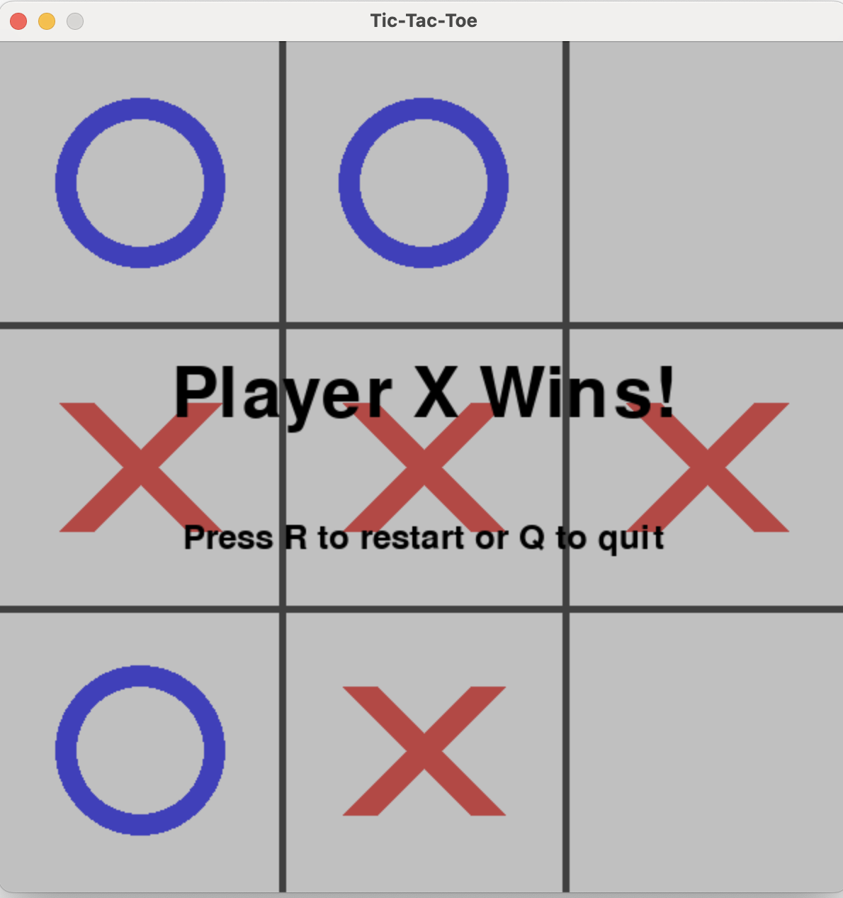

# 🕹️ Tic-Tac-Toe in Pygame  

A lightweight, cross-platform Tic-Tac-Toe game written in pure Python + Pygame.  
All core code was **generated, refactored, and debugged using _Amazon Q CLI_**, showcasing how an AI Agent can accelerate game-dev workflows.

## Screenshot
<p align="center">
  
</p>

---

## Features
- Classic 3×3 Tic-Tac-Toe with X / O pieces  
- Clean vector-style graphics (anti-aliased lines & circles)  
- Dynamic **current-player** indicator  
- **Game-over overlay** with restart / quit prompt  
- 60 FPS rendering loop for butter-smooth visuals  
- Single-file codebase (<300 LOC) – perfect for tutorial or hackathon demos  

---

## Requirements
| Dependency | Version |
|------------|---------|
| Python | 3.8+ |
| pygame | ≥ 2.0 |

---

## Installation

```bash
# 1) Clone the repo
git clone https://github.com/<your-handle>/qcli-python-tictactoe.git
cd qcli-python-tictactoe

# 2) Install dependencies
python -m pip install --upgrade pip
pip install pygame

# 3) Run the game
python tic_tac_toe.py
